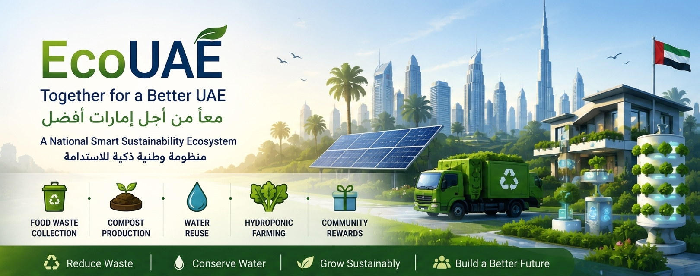
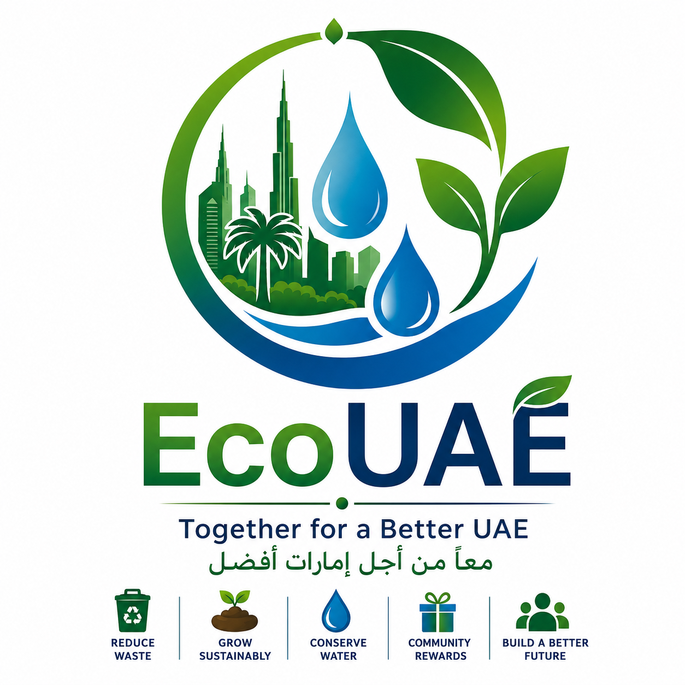
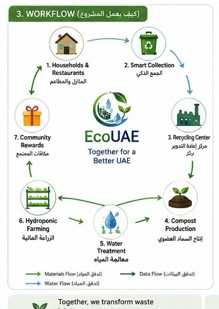
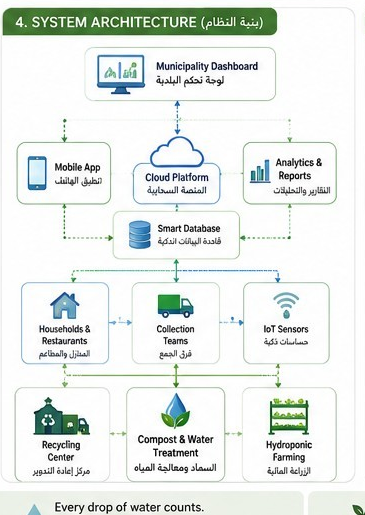
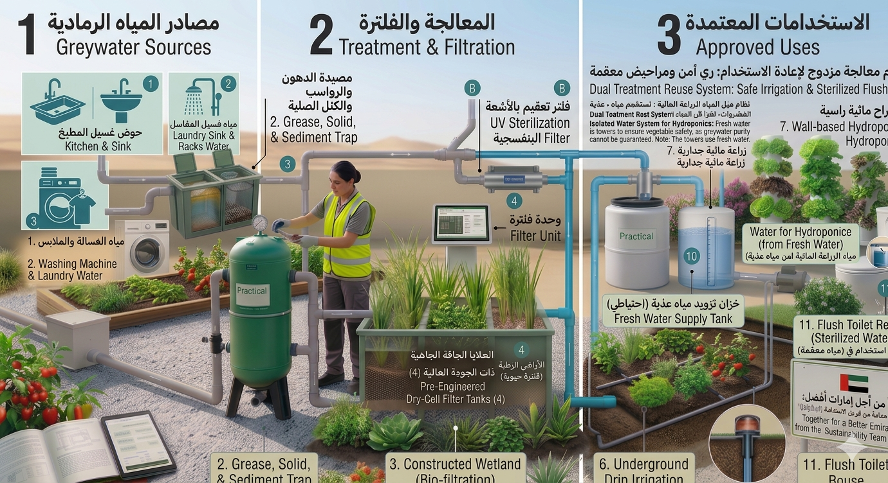
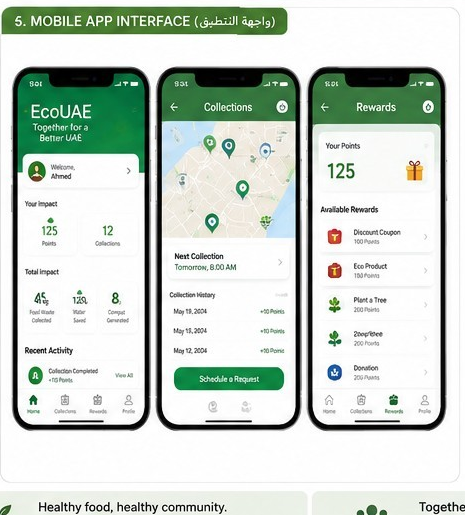
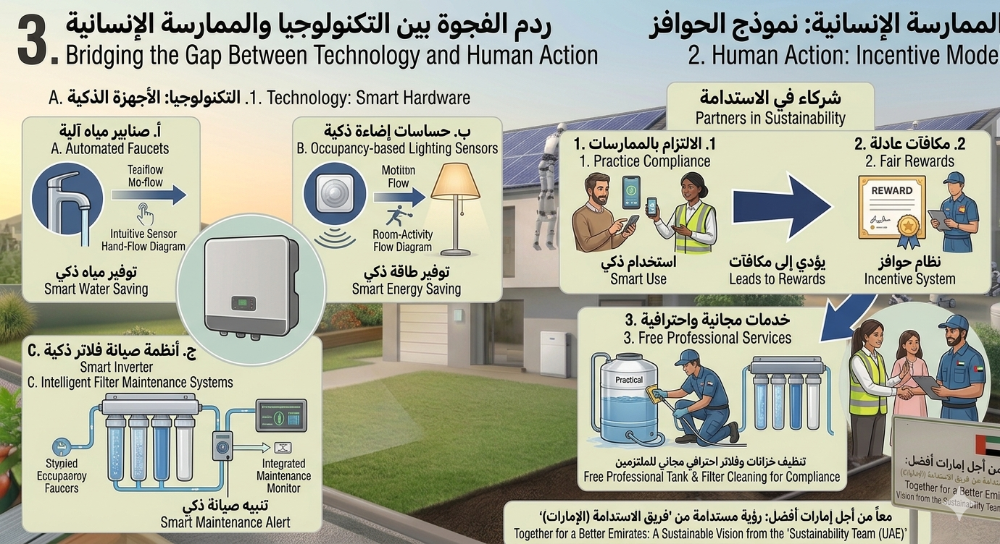
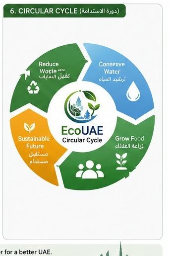
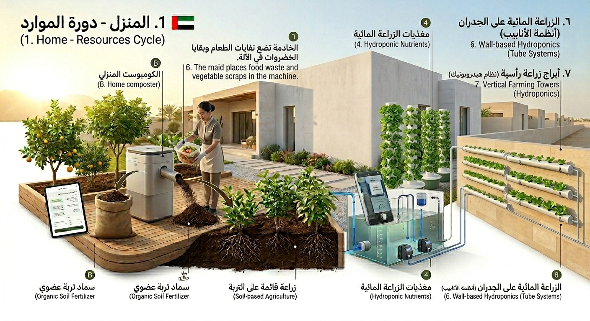
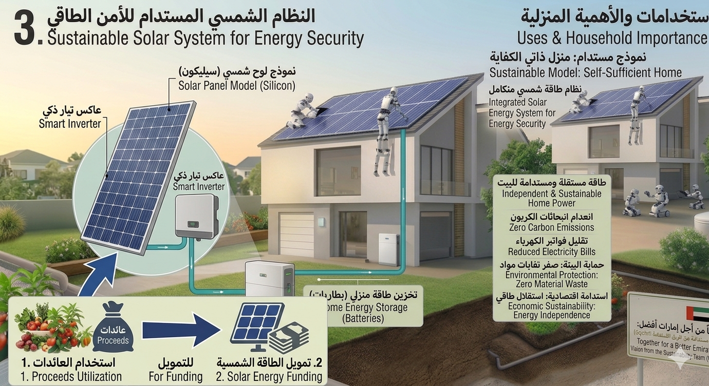

<p align="center">
  
</p>

<p align="center">
  
</p>
## 📑 Quick Navigation

- [Executive Summary](#-executive-summary--الملخص-التنفيذي)
- [Our Solution](#-our-solution--الحل)
- [Workflow](#-how-ecouae-works--كيف-يعمل-المشروع)
- [Technology Stack](#-technology-stack--التقنيات-المستخدمة)
- [Future Vision](#-future-vision--الرؤية-المستقبلية)
  
  ## 🎥 Demo Video

Watch the prototype in action:

https://youtu.be/87oTzra0PU8?si=pXbVylW1TuDobM1m

# 🌍 EcoUAE

## Together for a Better UAE
### معاً من أجل إمارات أفضل

> **Our UAE, Our Pride... Towards a More Sustainable Future.**
>
> **إماراتنا فخر... نحو مستقبل أكثر استدامة.**

<p align="center">


</p>

---

# Tatweer Hackathon 2026

**Challenge:** Challenge 5 – Free Choice

**Target Community:** Al Qua'a, Al Ain, United Arab Emirates

---

# 📑 Table of Contents

- Executive Summary
- Vision
- The Challenge
- Our Solution
- How EcoUAE Works
- Project Overview
- Pilot Implementation
- Impact
- Technology Stack
- Scalability
- Future Vision
- Project Information

---

# 🇦🇪 Executive Summary | الملخص التنفيذي

**EcoUAE** منصة وطنية ذكية للاستدامة تربط المنازل والمزارع والمطاعم والبلديات ضمن منظومة واحدة تدعم الاقتصاد الدائري.

يعتمد المشروع على دمج حلول موجودة ومثبتة عالميًا داخل نظام واحد يشمل:

- ♻️ إعادة تدوير نفايات الطعام وإنتاج السماد العضوي.
- 💧 إعادة استخدام المياه بطريقة آمنة.
- 🌱 دعم الزراعة المائية (Hydroponics).
- 🏆 نظام نقاط ومكافآت لتحفيز المجتمع.
- 📱 تطبيق ذكي للمواطنين.
- 📊 لوحة تحكم للبلدية وصناع القرار.

يبدأ المشروع بمرحلة تجريبية تشمل **10–20 منزلاً** ثم يتوسع تدريجيًا اعتمادًا على النتائج الفعلية.

كما يعيد استثمار جزء من عوائده المستقبلية في مشاريع مجتمعية مثل الطاقة الشمسية والإضاءة الذكية وأنظمة ترشيد المياه، مما يضمن استدامة المشروع على المدى الطويل.

---

# 🇬🇧 Executive Summary

**EcoUAE** is a smart sustainability ecosystem that connects households, farms, restaurants, and municipalities into one circular economy platform.

Rather than introducing new technologies, EcoUAE integrates proven solutions into one practical ecosystem including:

- Food waste recycling & compost production.
- Safe water reuse.
- Hydroponic farming.
- Community rewards.
- Smart mobile application.
- Municipality dashboard.

The project starts with a **10–20 household pilot** before expanding gradually based on measurable results.

Part of future revenues can be reinvested into community improvements such as solar energy, smart lighting, and water-saving technologies, ensuring long-term sustainability.

---
> EcoUAE is designed to support sustainable rural development through digital technologies, community participation, and efficient resource management, making it well suited for the Tatweer Hackathon challenge.

# 🎯 Vision | الرؤية

### 🇦🇪

أن تصبح كل أسرة شريكًا في حماية البيئة وتحويل الموارد المهدرة إلى قيمة اقتصادية واجتماعية تدعم رؤية دولة الإمارات في الاستدامة والابتكار.

### 🇬🇧

To empower every household to become an active sustainability partner by transforming waste into valuable resources while supporting the UAE's vision for innovation and environmental responsibility.

---
## 🚀 Why EcoUAE?

EcoUAE transforms waste into value by connecting households, municipalities, farms, and technology in one smart sustainability ecosystem.

### Key Benefits

- ♻️ Reduce food waste
- 💧 Save water
- 🌱 Increase local food production
- 🏆 Reward citizens
- 📊 Support municipality decision-making
- ☀️ Build a circular economy
 > EcoUAE directly supports digital infrastructure, sustainability, and community engagement for rural communities in Al Qua'a, aligning with the Tatweer Hackathon objectives.
  
# 🌍 The Challenge | التحدي

### 🇦🇪

رغم الإنجازات الكبيرة التي حققتها دولة الإمارات في الاستدامة، لا تزال بعض المجتمعات الريفية تواجه تحديات مترابطة تشمل:

- ♻️ هدر نفايات الطعام.
- 💧 ارتفاع استهلاك المياه.
- 🌱 محدودية الإنتاج الزراعي المحلي.
- 💰 ارتفاع تكاليف المعيشة.
- 🤝 ضعف المشاركة المجتمعية في مبادرات الاستدامة.

تكمن الفرصة في دمج الحلول الموجودة داخل منصة وطنية واحدة سهلة الاستخدام بإشراف البلدية.

---

### 🇬🇧

Rural communities continue to face interconnected sustainability challenges including:

- Food waste.
- Water efficiency.
- Limited local food production.
- Rising living costs.
- Community engagement.

While proven solutions already exist, EcoUAE combines them into one smart municipality-managed sustainability ecosystem.

---
# 💡 Our Solution | الحل

EcoUAE is a municipality-supervised sustainability ecosystem connecting households, restaurants, farms, private partners, and local authorities through one integrated smart platform.

بدلاً من معالجة كل تحدٍ بشكل منفصل، يحول EcoUAE النفايات إلى موارد، والموارد إلى قيمة اقتصادية وبيئية، ثم يعيد استثمار هذه القيمة لخدمة المجتمع.

---

# 🔄 Circular Sustainability Cycle

```text
🏠 Homes & Restaurants
        │
        ▼
♻️ Food Waste Collection
        │
        ▼
🌿 Organic Compost
        │
        ▼
🌱 Hydroponic Farming
        │
        ▼
🥬 Fresh Food Production
        │
        ▼
💰 Sustainable Revenue
        │
        ▼
🏆 Community Rewards
        │
        ▼
☀️ Solar Energy
💡 Smart Lighting
🚰 Smart Water Systems
        │
        ▼
🌍 Sustainable Communities
```

---

# ⚙️ How EcoUAE Works | كيف يعمل المشروع

EcoUAE follows a practical step-by-step workflow that enables gradual implementation under municipality supervision.

| Step | Description |
|------|-------------|
| **① Registration** | Users register through the EcoUAE mobile application and link their household to the platform. |
| **② Waste Separation** | Food waste, plastic, paper, cardboard and glass are separated into dedicated containers. |
| **③ Smart Collection** | Collection teams scan a QR code for each household and record collection digitally. |
| **④ Recycling** | Organic waste becomes compost, while recyclable materials are processed by recycling partners. |
| **⑤ Water Reuse** | Grey water, rainwater and AC condensate are collected, treated and reused according to environmental standards. |
| **⑥ Hydroponic Farming** | Compost and treated water support local hydroponic food production with minimal water consumption. |
| **⑦ Community Rewards** | Users earn points for recycling, saving water and participating in sustainability activities. |
| **⑧ Reinvestment** | Part of future revenues supports solar energy, smart lighting, tree planting and water-saving initiatives. |

---

## 🇦🇪 خطوات العمل باختصار

1. التسجيل عبر التطبيق.
2. فرز النفايات.
3. الجمع الذكي باستخدام QR.
4. إعادة التدوير وإنتاج السماد.
5. إعادة استخدام المياه.
6. الزراعة المائية.
7. نظام المكافآت.
8. إعادة استثمار العوائد في مشاريع الاستدامة.

---

# 📸 Project Overview

## 🔄 Workflow



---

## 🏗️ System Architecture



---
## 💧 Greywater Treatment

<p align="center">
  
</p>

## 📱 Mobile Application



---
## 🎁 Sustainability Incentive Model

<p align="center">
  
</p>
## ♻️ Circular Sustainability Cycle



---
## 🏡 Home Resources Cycle

<p align="center">
  
</p>

# 🇬🇧 Workflow Summary

1. Register
2. Separate waste
3. Smart collection
4. Recycling & Composting
5. Water Reuse
6. Hydroponic Farming
7. Community Rewards
8. Reinvestment
---
# 🚀 Pilot Implementation | خطة التنفيذ

EcoUAE is designed for gradual implementation, reducing risks while ensuring measurable results.

### Phase 1 — Pilot
- 10–20 households
- Municipality supervision
- Mobile application deployment
- User training
- KPI measurement

### Phase 2 — Community Expansion
- Schools
- Restaurants
- Small farms
- Volunteers
- Local businesses

### Phase 3 — City Expansion
- Multiple districts
- Municipality partnerships
- Private sector integration

### Phase 4 — National Expansion
- Rural communities across the UAE
- Integration with national sustainability initiatives

---

# 📈 Impact, Feasibility & Scalability | الأثر وقابلية التنفيذ والتوسع

## 🌍 Expected Community Impact

EcoUAE creates measurable environmental, economic and social value.

### Environmental
- ♻️ Reduce food waste.
- 🌱 Increase compost production.
- 💧 Improve water efficiency.
- 🥬 Support local food production.

### Economic
- 💼 Green jobs.
- 💰 Lower operational costs.
- 📈 Circular economy opportunities.

### Social
- 🤝 Stronger community participation.
- 🏡 Better quality of life.
- 🌍 Higher environmental awareness.

---

## 🏗️ Feasibility

The project relies entirely on existing and proven technologies including:

- Composting systems
- Recycling technologies
- Hydroponic farming
- Smart IoT sensors
- QR Code systems
- Mobile applications
- Municipality management systems
- Cloud computing

The innovation lies in integrating these technologies into one municipality-managed ecosystem rather than inventing new technologies.

---

## 🚀 Scalability

EcoUAE is designed to expand gradually.

| Stage | Coverage |
|--------|----------|
| Pilot | 10–20 households |
| Community | Neighborhood |
| City | Multiple districts |
| National | Rural UAE communities |

---

# 📊 Key Performance Indicators (KPIs)

Project success can be measured using:

- Number of participating households.
- Food waste recycled.
- Compost produced.
- Water reused.
- Hydroponic food production.
- Community participation.
- User satisfaction.
- Operational cost reduction.
- Sustainability projects funded.

---

# 🛠 Technology Stack | التقنيات المستخدمة

| Component | Purpose |
|-----------|----------|
| 📱 Mobile App | User registration & rewards |
| ☁ Cloud Platform | Data storage & synchronization |
| 📊 Municipality Dashboard | Monitoring & analytics |
| 📷 QR Codes | Household identification |
| 🌐 IoT Sensors | Water & farming monitoring |
| 🌱 Hydroponics | Local food production |
| ☀ Renewable Energy | Future sustainability projects |

---

# 🌍 Existing Technologies

EcoUAE integrates technologies already used worldwide:

- Composting
- Hydroponics
- Water Reuse
- Smart Sensors
- IoT
- QR Codes
- Cloud Computing
- Solar Energy

The project's innovation comes from combining these proven solutions into one practical national sustainability platform.

---
# ❤️ Our Vision | رؤيتنا

EcoUAE is more than an environmental initiative.

It is a national sustainability ecosystem that connects citizens, municipalities, businesses, and technology to build cleaner, smarter, and more resilient communities across the UAE.

---
## ☀️ Future Renewable Energy Integration

<p align="center">
  
</p>

# ▶️ Project Demonstration | عرض المشروع

The project can be demonstrated through:

- 📱 Interactive mobile application prototype.
- 📊 Municipality dashboard.
- 🔄 Workflow diagrams.
- 🏗️ System architecture.
- 🌱 Circular sustainability model.
- 🚀 Pilot implementation roadmap.

Future versions may include full integration with IoT devices and municipality digital services.

---

# 🎯 Why EcoUAE?

EcoUAE is designed around one simple principle:

> **Existing technologies become more powerful when they work together.**

### Key Strengths

- ✅ Integrates proven technologies instead of inventing new ones.
- ✅ Supports the UAE Circular Economy strategy.
- ✅ Encourages active community participation.
- ✅ Reduces food waste and improves water efficiency.
- ✅ Enables gradual implementation with measurable KPIs.
- ✅ Scalable from a small pilot to a national platform.
- ✅ Generates long-term environmental, social, and economic value.

---

# 🔮 Future Vision | الرؤية المستقبلية

As EcoUAE grows, additional smart services can be integrated, including:

- ☀️ Residential solar energy systems.
- 💡 Smart public lighting.
- 🚰 Smart water-saving devices.
- 🌳 Community greening projects.
- 🤖 AI-powered waste collection optimization.
- 📈 Real-time environmental analytics for decision makers.

---

# 👨‍💻 Project Information

| Item | Details |
|------|---------|
| **Project Name** | EcoUAE – Together for a Better UAE |
| **Challenge** | Tatweer Hackathon 2026 – Challenge 5 |
| **Category** | Smart Sustainability Ecosystem |
| **Target Community** | Al Qua'a, Al Ain, United Arab Emirates |
| **Project Status** | Hackathon Prototype |

---

# 📚 References

The project is inspired by internationally adopted sustainability practices, including:

- Circular Economy
- Hydroponics
- Composting
- Water Reuse
- Smart Cities
- Internet of Things (IoT)

---

# 🤝 Acknowledgements

We sincerely thank the organizers of **Tatweer Hackathon 2026** for providing an opportunity to develop innovative solutions that contribute to sustainable rural communities across the UAE.

---

# 📄 License

This repository was developed as part of **Tatweer Hackathon 2026**.

© 2026 EcoUAE Project Team. All rights reserved.

---

# 🌍 Final Message | الرسالة الختامية

## 🇦🇪

نؤمن بأن الاستدامة تبدأ من كل منزل، وكل أسرة، وكل فرد.

يقدم **EcoUAE** نموذجًا عمليًا يجمع المجتمع والبلدية والقطاع الخاص في منظومة واحدة لتحويل الموارد المهدرة إلى قيمة مستدامة تدعم مستقبل دولة الإمارات.

---

## 🇬🇧

We believe sustainability starts with every home, every family, and every individual.

**EcoUAE** transforms waste into opportunity through one integrated sustainability ecosystem that empowers communities and supports a smarter, greener future for the UAE.

---

# ⭐ Thank You

<p align="center">

## **EcoUAE**

### Together for a Better UAE

### معاً من أجل إمارات أفضل

🇦🇪 Proudly Designed for Tatweer Hackathon 2026

</p>
